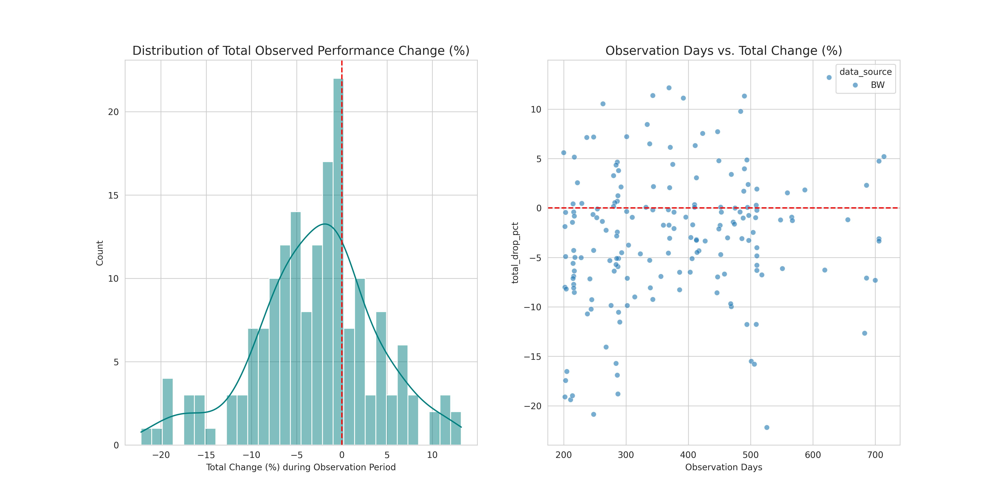
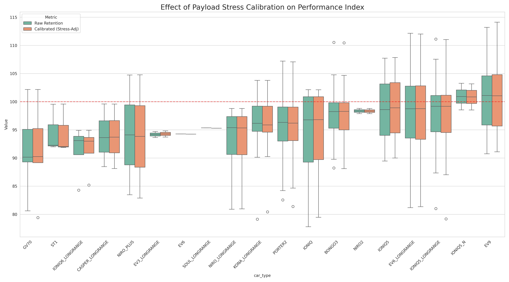
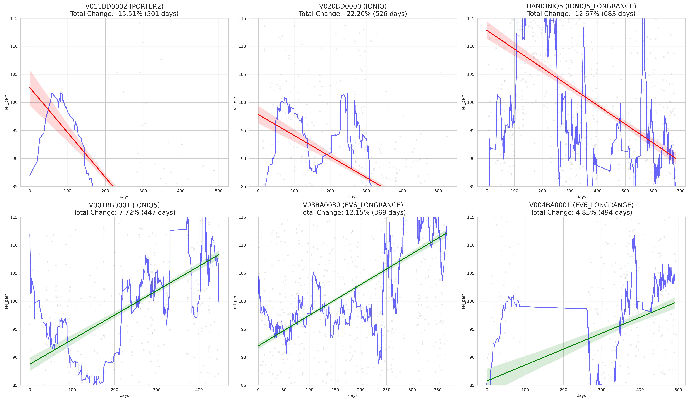
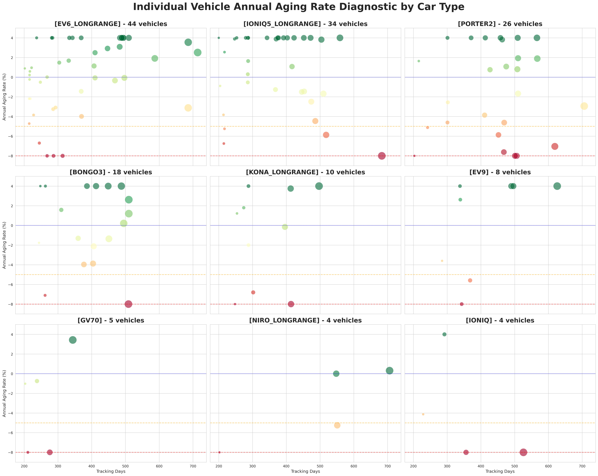
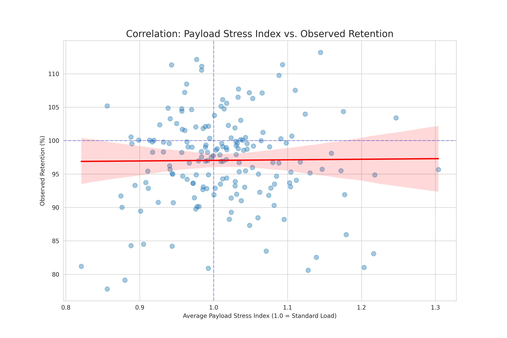

# 🔋 EV 배터리 및 전비 노화 정밀 진단 시스템 (BASS) 기술 명세서

본 문서는 전기차(EV) 시계열 데이터를 활용하여 배터리 성능 저하를 진단하는 분석 엔진의 논리적 근거와 세부 설계 기준을 상세히 설명합니다.

---

## 1. 전비 보정의 필요성 (Why We Normalize?)
전기차의 '전비(kWh/km)'는 물리적으로 매우 불안정한 지표입니다. 보정 없이 전비 수치만으로 노화를 판단하면 다음과 같은 오류가 발생합니다.

*   **온도 및 계절 영향 (Temperature & Seasonality)**: 영하의 날씨에서는 배터리 내부 저항 증가와 히터 가동으로 전비가 최대 40%까지 급락합니다. 이를 보정하지 않으면 **"겨울에 운행한 모든 차는 노화되었다"**는 잘못된 결론에 도달합니다.
*   **주행 속도 영향 (Aerodynamic Drag)**: 공기 저항은 속도의 제곱에 비례합니다. 고속도로 위주 주행 차량이 시내 주행 차량보다 전비가 낮은 것은 물리적 당연함이지 성능 저하가 아닙니다.
*   **차급 및 용량 차이 (Capacity & Segment)**: 대형 SUV와 경차의 전비를 직접 비교하는 것은 공정하지 않습니다. 각 차급이 가진 물리적 한계를 인지해야 합니다.

**[해결책]**: Huber Regression 모델을 통해 온도(`avg_temp`), 온도 제곱(`temp_sq`), 주행 속도(`avg_speed`)를 독립 변수로 입력하여, **"모든 차량이 20도 기온에서 60km/h로 정속 주행했다면?"**을 가정한 보정 전비(`norm_kwh`)를 산출합니다.

---

## 2. 계층적 베이스라인 결정 로직 (Case 1~4)
"어떤 상태가 100점인가?"를 결정하는 기준은 데이터의 양에 따라 4단계로 자동 전환됩니다. 이는 데이터가 부족한 차종이 억울하게 평가받는 것을 방지하기 위함입니다.

| 구분 | 명칭 | 선정 기준 (Criteria) | 선정 이유 및 목적 |
|:---:|:---|:---|:---|
| **Case 1** | **차종 전용** | 동일 차종 신차(<1만km) 데이터가 500세션 이상일 때 | 가장 정확한 기준. 동일 하드웨어를 가진 신차의 성적을 100점으로 설정하여 오차를 최소화함. |
| **Case 2** | **세그먼트 가중** | 동일 차종 데이터가 부족하나 유사 세그먼트 데이터는 풍부할 때 | 데이터 부족에 의한 통계적 왜곡 방지. 해당 차종 성적과 유사 그룹(예: 중형 SUV) 성적을 가중치 있게 섞어 안정적 기준 수립. |
| **Case 3** | **ReVIN 매핑** | 신차 데이터가 거의 없는 특수/신규 차종일 때 | **Instance Normalization** 기법 적용. 차량의 현재 분포 특성을 세그먼트 전체의 통계적 분포로 강제 매핑하여 베이스라인을 역추적함. |
| **Case 4** | **글로벌 평균** | 위 모든 기준에 부합하지 않는 완전한 신규 케이스 | 진단 불가를 방지하기 위한 최소한의 장치. 전체 차량의 중앙값을 임시 기준으로 활용. |

---

## 3. 트러블슈팅 및 모델 진화 과정 (Troubleshooting & Evolution)

분석 과정에서 발견된 치명적인 오류들과 이를 극복하기 위한 고도화 단계입니다.

### Issue 1: 선형 외삽의 함정과 가짜 노화율 (-400% 사건)
*   **문제**: 관측 기간이 짧은 차량의 단기 전비 변동을 365일로 단순 외삽(Extrapolation)할 경우, 연간 노화율이 -400%처럼 비현실적인 수치로 증폭되는 현상 발생.
*   **해결 (v3)**: 
    1.  **지표의 이원화**: 현재 상태를 나타내는 **'총 성능 변화량(Total Change)'**과 미래 추세를 나타내는 **'노화 속도(Velocity)'**를 분리하여 관리합니다.
    2.  **Best-Ever Baseline**: 초기 100세션 중 최상위 효율 구간을 100%로 설정하여, 운전 습관 개선에 의한 '가짜 성능 향상'을 제거하고 순수 노화 추세를 검출합니다.
    3.  **Huber Robust Regression**: 이상치(Outlier)에 둔감한 Huber 손실 함수를 사용하여 단기 노이즈가 전체 기울기를 왜곡하지 않도록 방어합니다.
*   **결과**:  (현실적인 노화 수치 분포 확보)

### Issue 2: 상용차의 억울한 저득점 (과적 vs 노화)
*   **문제**: 포터2, 봉고3 등 상용차가 배터리는 건강함에도 무거운 짐을 실어 전비가 낮게 측정되어 '노화 고위험군'으로 오진됨.
*   **해결**: **Payload Stress Index** 도입. 동일 속도 구간의 타 차량 대비 에너지 초과 소모량을 계산하여 '적재 스트레스'를 수치화하고 이를 PI에서 보정함.
*   **결과**:  (상용차 PI가 100% 근처로 대폭 복원됨)

### Issue 3: 단기 주행 패턴에 의한 추세 왜곡
*   **문제**: 하루 이틀 험하게 운전한 데이터가 전체 노화 회귀선의 기울기를 망가뜨림.
*   **해결**: **30일 이동 평균(Moving Average)** 필터 적용. 개별 세션의 노이즈를 걷어내고 묵직한 배터리 건강 상태의 흐름만 추출.
*   **결과**:  (부드럽고 논리적인 노화 궤적 도출)

---

## 4. 왜 "처음값"을 기준으로 분석하는가? (Self-Referenced Baseline)
기존의 타 차량 대비 비교(Fleet-based) 방식은 **"내 차가 원래 효율이 안 좋은 모델인 건지, 아니면 타다가 나빠진 건지"**를 구분할 수 없습니다.

*   **개별 특성 수용**: 어떤 차량은 처음부터 연비 주행을 잘했고, 어떤 차량은 처음부터 적재량이 많았을 수 있습니다.
*   **노화의 정의**: 노화는 **"과거의 나 대비 현재의 내가 얼마나 변했는가"**의 문제입니다.
*   **분석 방법**: 각 차량의 데이터 관측 초기 100세션 중 **가장 전비가 좋았던(Best Efficiency) 20세션의 중앙값**을 '건강했던 시절(100%)'로 정의합니다. 
*   **목적**: 운전자가 가장 경제적으로 운전했거나 적재량이 적었던 '잠재적 최상 성능'을 기준으로 삼음으로써, 이후 발생하는 성능 저하(노화)를 물리적으로 더 타당하게(우하향 추세 위주로) 검출합니다.

---

## 5. 최종 시각화 산출물 요약 (Key Visuals)

### 📊 [진단 결과] 차종별 노화 분포 및 개별 차량 진단 (Status vs. Velocity)
차량의 현재 건강 상태(Status)와 성능 저하 속도(Velocity)를 결합한 **진단 지도**입니다. 우측 하단(High Risk)에 위치한 차량이 정밀 점검 대상입니다.

### ⚖️ [보정 효과] 적재 및 주행 스트레스 보정 (Calibration)
단순 전비가 아닌, 실제 부하(Payload)를 고려했을 때 성능 지수가 어떻게 정상 범위로 복원되는지 입증합니다.

### 📈 [노화 추세] 고위험군 vs 우수 차량 추세 분석
시간의 흐름에 따른 성능 유지율(Retention)의 변화를 추적하여, 실제 노화가 진행 중인 차량을 선별합니다.

### 🚛 [스트레스 분석] 적재량과 전비의 상관관계
상용차 등에서 적재량(Payload)이 전비 하락에 미치는 물리적 영향을 분석한 근거 데이터입니다.

### 🏁 [최종 보고] 관측 기간 내 실제 성능 변화량
데이터 외삽(Extrapolation)에 의한 왜곡을 제거하고, 실제 관측된 기간 동안의 총 성능 변화량을 집계한 결과입니다.

---

**최종 업데이트**: 2025-12-24
**버전**: BASS v3.0

## 6. 분석 알고리즘 및 수학적 근거 (Mathematical Rationale)

본 시스템은 단순 평균비교가 아닌, 통계학적 강건성(Robustness)을 확보하기 위해 다음과 같은 기법을 적용합니다.

### ① Huber Regression: 이상치(Outlier)에 대한 방어력
*   **사용처**: 전비 보정 모델 생성 및 노화 기울기(Slope) 산출.
*   **이유**: 일반 선형 회귀(OLS)는 오차의 제곱을 최소화하므로 극단적인 데이터(과속, 급가속 등)에 의해 전체 결과가 크게 휘둘립니다. Huber 모델은 일정 범위를 벗어나는 이상치를 절대값(L1)으로 처리하여, **"어쩌다 한 번 발생한 특이 주행"**을 무시하고 배터리의 본질적인 건강 상태만 추적합니다.

### ② Quadratic Temperature Model (온도 제곱 보정)
*   **기법**: 보정 식에 `temp` 뿐만 아니라 `temp_sq`(온도의 제곱) 항을 포함.
*   **이유**: 전기차 배터리 효율은 선형적으로 변하지 않습니다. 상온 대비 저온에서 효율이 급격히 떨어지는 **비선형적 특성(U-Curve)**을 정확히 반영하기 위해 2차 함수 모델을 사용하여 보정 정밀도를 극대화했습니다.

### ③ Hierarchical Baseline Logic (계층적 기준 설정)
*   **기법**: 데이터 밀도에 따라 Case 1(차종) -> Case 2(세그먼트) -> Case 3(ReVIN) 순으로 기준을 자동 전환.
*   **이유**: 신차 데이터가 부족한 희귀 차종이나 신규 모델의 경우, 잘못된 기준점 설정으로 인해 성능이 왜곡될 위험이 큽니다. 유사 물리 특성을 가진 세그먼트 데이터를 계층적으로 참조하여 **"데이터가 적어도 억울하게 평가받지 않는"** 공정성을 확보했습니다.

### ④ 30-day Moving Average & Rolling Median
*   **기법**: 개별 세션 데이터가 아닌, 30일 이동 평균된 시계열 데이터로 노화 분석 수행.
*   **이유**: 하루 단위의 운전 습관이나 주행 경로 차이에서 오는 노이즈를 필터링하고, 배터리의 화학적/물리적 감퇴라는 **장기적 추세(Long-term Trend)**에만 집중하기 위함입니다.
